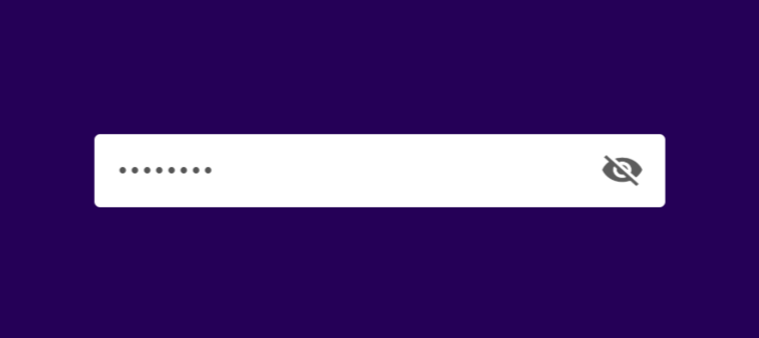
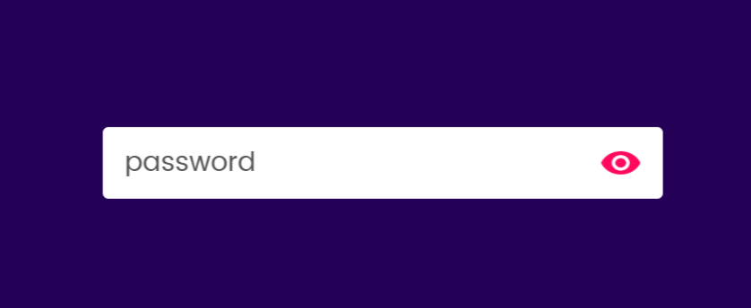

# Hide and Show Password Toggle

## Project Overview

This project implements a **Hide and Show Password Toggle** feature using HTML, CSS, and JavaScript. The feature allows users to toggle the visibility of their password input field by clicking an eye icon, enhancing usability and convenience.

---

## Features

- **Password Toggle**: Show or hide the password by toggling between `text` and `password` input types.
- **Dynamic Icon Update**: The eye icon changes based on the visibility state (open or closed).
- **Responsive Design**: The input box is designed to adapt to different screen sizes.

---

## Technology Stack

- **HTML**: Markup for the input box and eye icon.
- **CSS**: Styling for the input box and overall layout.
- **JavaScript**: Logic for toggling password visibility and updating the eye icon dynamically.

---

## How to Use

1. Clone or download the repository to your local machine.
2. Ensure the following files are in the project directory:
   - `index.html`: HTML structure.
   - `style.css`: CSS for styling.
   - `eye-open.png`: Icon for the "visible" state.
   - `eye-close.png`: Icon for the "hidden" state.
3. Open `index.html` in any web browser.
4. Enter your password in the input field and click the eye icon to toggle visibility.

---

## Folder Structure

root/
├── index.html # HTML file for the project
├── style.css # CSS for styling
├── eye-open.png # Icon for the visible password state
├── eye-close.png # Icon for the hidden password state
└── README.md # Project documentation

---

## Screenshots

### Password Hidden State

### Password Visible State

---

## License

This project is open-source and available under the [MIT License](LICENSE).

---

### Author

Created by **@divcs** – A simple project to enhance web forms!
